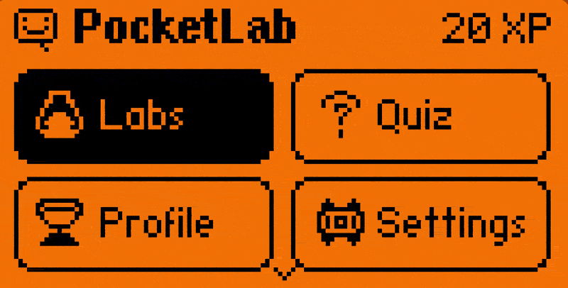
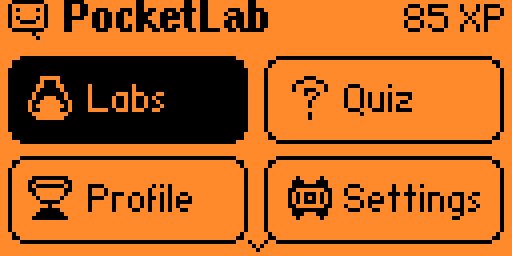
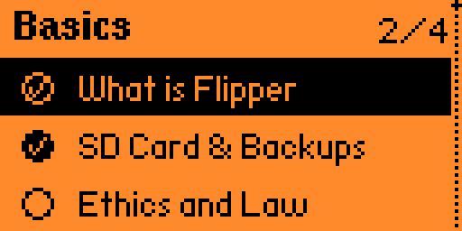
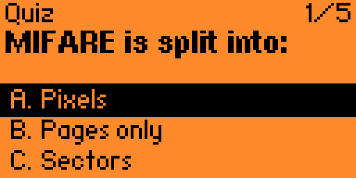
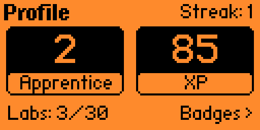
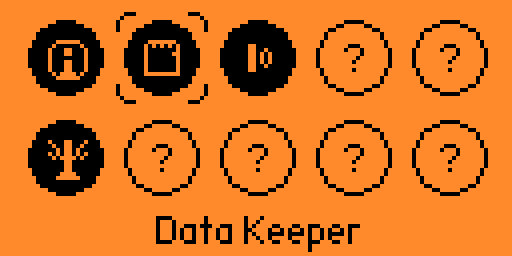
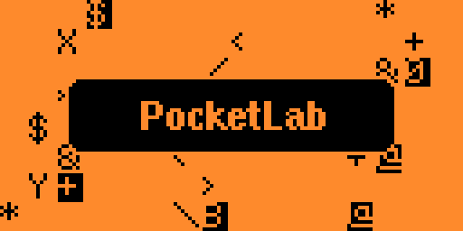

<div align="center">

# PocketLab



<br/>

**Gamified, on-device learning for [Flipper Zero](https://github.com/flipperdevices).**

[](LICENSE)
[](https://github.com/PerfectoWeb/flipper-pocketlab/releases/latest)
[](https://flipperzero.one/)

</div>

---

## 📚 What is it?

The biggest problem in the Flipper ecosystem is new-user churn: people buy a
[Flipper Zero](https://github.com/flipperdevices), don't know where to start, get
bored, and resell it. **PocketLab is the missing onboarding layer** – a guided,
legal and genuinely fun way to learn what your Flipper can do, one small lab at a
time.

## ✨ Features

- 🎓 **30 labs** across 11 tracks: IR, Sub-GHz, RFID, NFC, iButton, Bad USB,
  GPIO, Bluetooth, security, system and more
- 🎲 **Randomized quizzes** – a pool of distractors, shuffled every attempt, so
  you learn the answer, not its position
- 🧠 **Quiz mode** – a random exam drawn from the labs you've completed, scored
  at the end, to test what stuck
- 🏆 **Progression** – XP, levels, a daily streak and unlockable badges, all
  saved on the SD card
- 🖼️ **Per-topic glyphs** next to each lesson title, so the subject reads at a glance
- 🔊 **Sound & LED** – audio feedback with the RGB LED blinking to the reward tune
- 🖥️ **Custom animated UI** – tile menu, a badge gallery, stat cards and a
  matrix-rain About screen
- 📦 **No extra hardware** – pure software, runs on a stock Flipper Zero


## 📸 Screenshots

<div align="center">

| Menu | Labs | Quiz |
|:---:|:---:|:---:|
|  |  |  |
| **Profile** | **Achievements** | **About** |
|  |  |  |

</div>

## 📥 Installation

### ⬇️ Download the ready app (recommended)

1. Download **`pocketlab.fap`** from the
   [latest release »](https://github.com/PerfectoWeb/flipper-pocketlab/releases/latest/download/pocketlab.fap)
2. Copy it to your Flipper's SD card into `apps/Tools/`
   (easiest with **qFlipper** – just drag the file into that folder)
3. On the device open **Apps → Tools → PocketLab** 🎉

### 🛠️ Build from source (ufbt)

<details>
<summary>Show build instructions</summary>

[`ufbt`](https://pypi.org/project/ufbt/) builds Flipper apps without a full
firmware checkout:

```sh
pipx install ufbt                # or: pip3 install --user ufbt

git clone https://github.com/PerfectoWeb/flipper-pocketlab.git
cd flipper-pocketlab

ufbt              # builds dist/pocketlab.fap
ufbt launch       # build, upload to a connected Flipper, and run
```

The build output lands in `dist/pocketlab.fap`.

</details>

## 🧩 Create your own lab

Labs are **data, not code**. Add a `PocketLabStep` array and a `PocketLabLab`
entry in [`helpers/pocketlab_content.c`](helpers/pocketlab_content.c) – the engine
renders `text`, `quiz`, `try` and `reward` steps for you. No engine changes needed.

## 🏗️ Architecture

Standard Flipper app structure: a `ViewDispatcher` driving a `SceneManager`, with
content and state kept as plain data.

```text
pocketlab.c              App lifecycle, XP/level/award logic, entry point
pocketlab_i.h            Shared app context and public helpers
scenes/                  SceneManager scenes (menu, labs, lesson, progress, badges,
                         levelup, exam, settings, reset_confirm, about)
views/                   Custom animated views (home, lesson, labs list, progress,
                         badges, levelup, exam, about)
helpers/
  pocketlab_content.*    Labs as data (step arrays + topic glyph)
  pocketlab_i18n.*       UI string table
  pocketlab_sound.*      Notification sequences
  pocketlab_storage.*    Versioned save/load on the SD card
```

## ❤️ Support & contribute

PocketLab is just getting started – and it grows fastest with your help.

- 💡 **Got an idea** for a lab or feature? [Open an issue](https://github.com/PerfectoWeb/flipper-pocketlab/issues) – I read every one.
- 🛠️ **Built something?** Send a pull request. New labs are just data in
  [`pocketlab_content.c`](helpers/pocketlab_content.c), so they're quick to add and easy to review.
- ⭐ **Enjoying it?** Star the repo – it genuinely helps others find the project.

Every idea and PR is reviewed, and the good ones get **merged and shipped**. Thank you! 🙌

## 📝 License

MIT – see [LICENSE](LICENSE). Built with care by [PerfectoWeb](https://github.com/PerfectoWeb).
